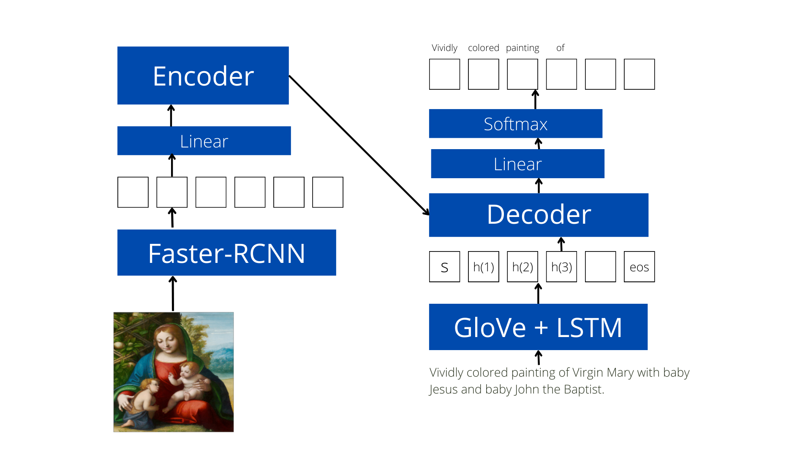

## Tagging Christian Art using a Multimodal Transformer
Computer version of Emile Male!

### About the project
Christian Iconography refers to the study of identifying the saints in a painting by using the attributes such as a crucifix, pedestal or key. Art historians such as Emile Male have spent a significant amount of time describing this art. Due to their contributions, while most of this art is available digitally with provided captions, there still doesn’t exist a "ground-truth" dataset for the same. Hence the goal of this project is to curate a dataset for tagging this arena of art. As a second direction, this project proposes the use of a Multimodal Transformer to automate the process of tagging. While this would never replace the actual historian it still has possibilities in reducing the burden on actual professionals and helping out people who might not be well-versed with Christian Art.

### Pipeline

#### 1. Data curation

#### 2. Captioning model

