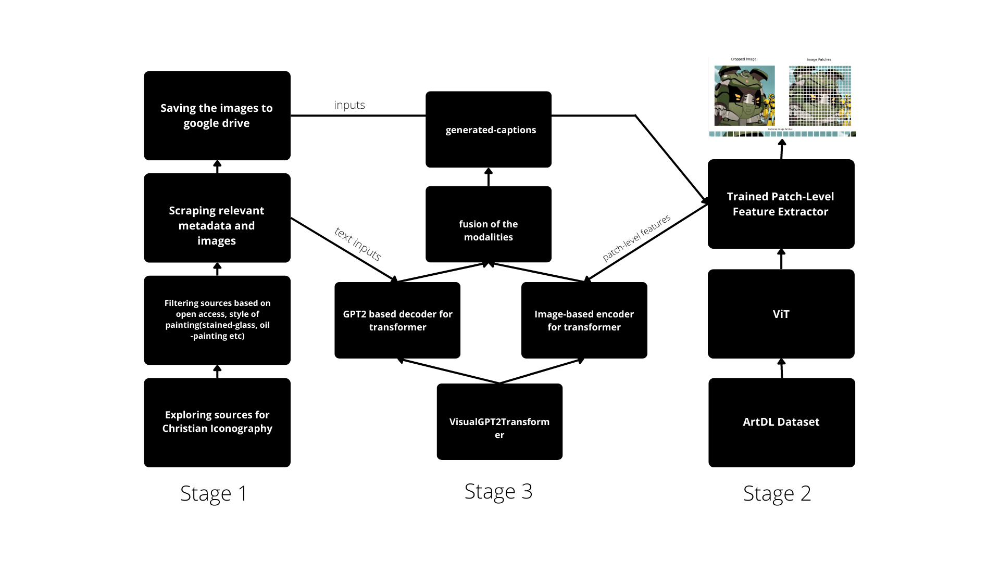

# Christian Art Tagging

Tagging Christian Art pieces using Computer Vision!

## Summary of Contents
<details open="open">
  <ol>
    <li>
      <a href="#about-the-project">About The Project</a>
      <ul>
        <li><a href="#built-with">Built With</a></li>
      </ul>
    </li>
    <li><a href="#pipeline">Pipeline</a></li>
    <li><a href="#milestones">Milestones</a></li>
    <li><a href="#future-deliverables">Future Deliverables</a></li>
    <li>
      <a href="#getting-started">Getting Started</a>
      <ul>
        <li><a href="#prerequisites">Prerequisites</a></li>
        <li><a href="#setup">Setup</a></li>
      </ul>
    </li>
    <li><a href="#usage">Usage</a></li>
    <li><a href="#blog">Blog</a></li>
    <li><a href="#roadmap">Roadmap</a></li>
    <li><a href="#license">License</a></li>
    <li><a href="#contact">Contact</a></li>
   
  </ol>
</details>

<!-- ABOUT THE PROJECT -->
## About The Project
Christian Iconography refers to the study of identifying the saints in a painting by using the attributes such as a crucifix, pedestal or key. Art historians such as Emile Male have spent a significant amount of time describing this art. Due to their contributions, while most of this art is available digitally with provided captions, there still doesn’t exist a "ground-truth" dataset for the same. Hence the goal of this project is to curate a dataset for tagging this arena of art. As a second direction, this project proposes the use of a Multimodal Transformer to automate the process of tagging. While this would never replace the actual historian it still has possibilities in reducing the burden on actual professionals and helping out people who might not be well-versed with Christian Art.


### Built With
* [OpenCV](https://opencv.org/)
* [PyTorch](https://pytorch.org/)
* [Numpy, Pandas](https://pandas.pydata.org/)
* [Huggingface]()
* [Singularity]()
* [Docker]()
* [Detectron2]()

## Pipeline


## Milestones
- Curated a dataset of 9.6k images with provided captions, titles, and miscellanous metadata
- Worked on a feature extractor module that can also detect the saints and their attributes in the painting
- Finally, managed to deliver a ViT+GPT2 based Transformer that uses images + prompts to caption the Christian Icons in the painting

## Future Deliverables
- Improving the quality of curated captions in order to build a more robust model
- Improving the performance of the multimodal transformer for describing intricate details in the painting. 
- Working on a module that can let people add more data points to the dataset that I have curated.

<!-- GETTING STARTED -->
## Getting Started

### Prerequisites
- Python versions 3.6-3.10

### Setup
1. Clone the repository from github

```
git clone https://github.com/lazyCodes7/RedHenLab_Multimodal_Christian_Art_Tagging.git
```

2. Go the directory where the repository is cloned and activate a virtual environment as follows
```
cd RedHenLab_Multimodal_Christian_Art_Tagging
virtualenv cenv
source cenv/bin/activate
```

3. Install the requirements(Python)
```
pip install -r requirements.txt
```

4. Install [Docker](https://docs.docker.com/desktop/install/linux-install/) and [Singularity](https://singularity-tutorial.github.io/01-installation/)

## Usage
### 1. Running the Emile Male Pipeline on Case HPC
#### Intro to Case HPC
Computationally intensive research is supported through the operation of continuously growing high performance computing cluster based on Dell PowerEdge servers with Intel processors and Red Hat Enterprise Linux. Details of the cluster configuration can be found at the link below.

Know more [here](https://sites.google.com/a/case.edu/hpcc/)

#### Logging in to Case HPC + Locating to Home directory + Required files
Folllow these steps and replace rpm93 with your username
```
ssh -vv rpm93@rider.case.edu
# After login
cd /mnt/rds/redhen/gallina/home/rpm93
# After reaching home
git clone https://github.com/lazyCodes7/RedHenLab_Multimodal_Christian_Art_Tagging.git
```

#### Requesting GPU on Case HPC
Case Western provides access to certain gpu nodes for processing. If you want to access one. Try running ```si``` first to see which ones are available and run the following command to access the gpu

```
srun -p gpu -C gpu2v100 --nodelist=gpu059t --gres=gpu:1 --mem=50gb --pty bash
```
View more on this in my [blog](https://lazycodes7.github.io/posts/week11/)

#### Syncing files on Case HPC
Now you are using a GPU node hopefully. But all files have disappeared! So we need to sync the files over here. Here is an example on how to do this if my username is rpm93.

```
rsync -az hpc3:/mnt/rds/redhen/gallina/home/rpm93/RedHenLab_Multimodal_Christian_Art_Tagging/ /tmp/$USER/
```

#### Navigate to the Pipeline + Running the script
Once the files are synced. Next step is to locate the script for running the pipeline. The example is for user rpm93
```
cd rpm93/pipeline
bash run_pipeline.sh
```

#### Interpreting the script
```
#!/bin/bash
echo "-----------------------------------------------------"
echo "Emile Male Pipeline: Training"
rsync -az hpc3:/mnt/rds/redhen/gallina/home/rpm93/RedHenLab_Multimodal_Christian_Art_Tagging/ /tmp/$USER/
echo "Files synced successfully"

echo "Creating singularity enviroment...."
module load singularity/3.8.1
singularity pull docker://ghcr.io/lazycodes7/christian-art-tagging:latest
mkdir curation/EmileMaleDataset
echo "Enviroment successfully created."

echo "Stage: 1 - Generating the Curated Dataset"
singularity run --nv christian-art-tagging_latest.sif python curation/generator.py --metadata_path curation/metadata_v2.csv --data_dir curation/EmileMaleDataset/

echo "Stage: 2- Training the feature-extractor to extract patch level features"
singularity run --nv christian-art-tagging_latest.sif python feature_extractor/train.py -c --train --device cuda --data_dir feature_extractor/

echo "Stage: 3- Training the Image-Captioning model that uses intra-modal features"
singularity run --nv christian-art-tagging_latest.sif python captioning/train.py --data_dir curation/EmileMaleDataset/ --feature_extractor_path feature_extractor/artDL.pt --device cuda --train

```

As we can see in the script the pipeline is an amalgamation of three individual modules. The first module is curation which as the name suggests downloads the dataset I have collected. The second step is to train a feature extractor that can extract features from the images. The current version of the pipeline uses a Vision Transformer instead of using FRCNN([Why](https://lazycodes7.github.io/posts/week14/) this though). Finally we have the captioning model aka a transformer that leverages both the image and text to generate captions.

### 2. Running the modules from the pipeline locally.
In order to run the modules from the pipeline follow the steps used in setup and use ```cd pipeline``` to navigate to the pipeline

#### Singularity setup
While we do not need singularity to run the modules locally. Here is how to setup the container for local use.
```
singularity pull docker://ghcr.io/lazycodes7/christian-art-tagging:latest
```
#### Running the curation module locally.
##### Help
```
    -p/--metadata_path - The path to metadata file
    -d/--data_dir - The path to download the dataset to
    -f/--force - Force download an image even if it is already downloaded
```
##### Example
```
# using singularity
singularity run --nv christian-art-tagging_latest.sif python curation/generator.py --metadata_path curation/metadata_v2.csv --data_dir curation/EmileMaleDataset/

# just running
python curation/generator.py --metadata_path curation/metadata_v2.csv --data_dir curation/EmileMaleDataset/

```

##### Outputs
9.6K Data points from different museums consisting of different art styles

#### Running the feature_extraction module locally.
##### Help
```
    -b, --train_batch_size - Batch size for training
    --data_dir - Directory to use images for training
    --device - Device to train/test on
    --train - Flag to train/test
    -p,--model_path - Trained model path to be used during testing
    -c, --collect - Collect the ArtDL dataset if not already present

```
##### Example
```
# using singularity
singularity run --nv christian-art-tagging_latest.sif python feature_extractor/train.py -c --train --device cuda --data_dir feature_extractor/

# just running
python feature_extractor/train.py -c --train --device cuda --data_dir feature_extractor/
```

##### Outputs 
Weights for feature-extraction model that are to be used in the captioning module

#### Running the captioning module locally.
##### Help
```
    --metadata_path - The path to metadata file
    --data_dir - Directory to use images for training
    --feature_extractor_path - Model path from stage-2 feature extractor
    -e, --epochs - No of epochs to train the model for
    -lr, --learning_rate - Learning rate for the model
    -d, --device - Device to train/test on
    --train - Flag to train/test
    --train_batch_size - Batch size for training
    --captioning_model_path - Saved path of the captioning model(Useful during inference)

```
##### Example
```
# using singularity
singularity run --nv christian-art-tagging_latest.sif python captioning/train.py --data_dir curation/EmileMaleDataset/ --feature_extractor_path feature_extractor/artDL.pt --device cuda --train

# just running
python captioning/train.py --data_dir curation/EmileMaleDataset/ --feature_extractor_path feature_extractor/artDL.pt --device cuda --train

```

##### Outputs 
Captions based on the prompts during inference and associated captioning metrics during training+testing. See the results [here](https://lazycodes7.github.io/posts/week16/)

## Blog
Know more details about how this project has progressed [here](https://lazycodes7.github.io/categories/google-summer-of-code/)

<!-- ROADMAP -->
## Roadmap

See the [open issues](https://github.com/lazyCodes7/RedHenLab_Multimodal_Christian_Art_Tagging/issues) for a list of proposed features (and known issues).


<!-- LICENSE -->
## License

Distributed under the MIT License. See `LICENSE` for more information.


<!-- CONTACT -->
## Contact

Rishab Mudliar - [@cheesetaco19](https://twitter.com/cheesetaco19) - rishabmudliar@gmail.com

Telegram: [lazyCodes7](https://t.me/lazyCodes7)

